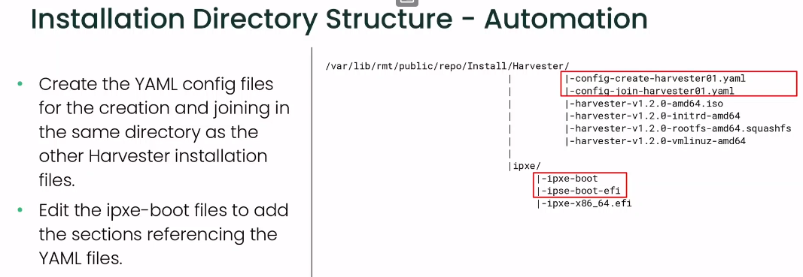

# harvester-certification

## Training Notes

### Harvester Deployment Process
The first 3 cluster nodes will act as the controller nodes for the cluster and run process such as **etcd** and the **Kubernetes API**. Any additional nodes will just be workers.

### Demonstration: Create a Harvester cluster
The default user to accesss Harvester nodes using SSH is Rancher. The user password is defined during the installation process.

## Automated Harvester Deployment
+ Automation can be done using network/iPXE installation method.
+ 2 files are used to automate the installation and the format is YAML.
+ The YAML can fully automate the deployment or provide additional configuration during a manual install

